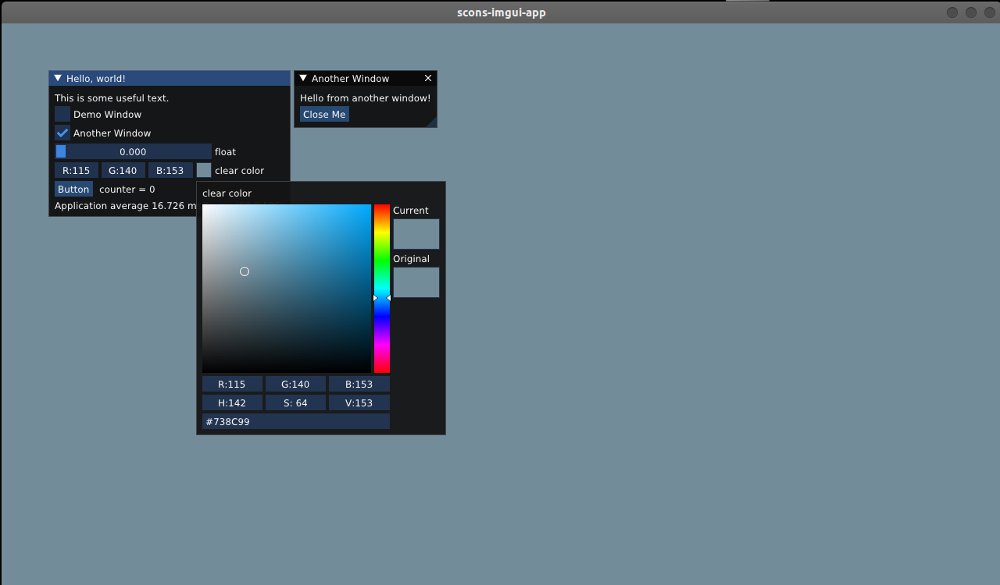

# scons-imgui-app

Simple cross platform ImGui application compiling with CMake and Scons. Tested on 1) Ubuntu 22.04, 2) Windows 11. Includes STD single header libraries and GLFW from download/local and backends.

<!--  -->


##### Commands
```
(For CMake Ubuntu:)
$ rm -rf build && mkdir build && cd build
$ cmake ..
$ cmake --build .
$ ./cmake-imgui-app
(For Scons Ubuntu and Windows:)
$ scons --clean
$ scons
(Exports to:)
$ ./ubuntu/application/scons-imgui-app
$ ./windows/application/scons-imgui-app.exe
```
